

  

Computer engineering student at the University of Isfahan. I work mostly on deep learning and generative models, and I like writing things from scratch, from TCP/IP stacks to console games. Currently building an [LLM agent that runs a smart home](https://github.com/Miaad2004/llm-home-assist-agent).

### Projects

  <a href="https://github.com/Miaad2004/Generating-Flowers-with-DCGANs-in-Pytorch"></a>
  <a href="https://github.com/Miaad2004/From-Edges-to-Cats-Pix2Pix-Image-Translation-in-TensorFlow"></a>
  <a href="https://github.com/Miaad2004/Unet-Based-Semantic-Segmentation-In-TensorFlow"></a>
  <a href="https://github.com/Miaad2004/Frozen-Lake-RL"></a>
  <a href="https://github.com/Miaad2004/FTP-Implementation-With-Custom-TCP-IP-Stack"></a>
  <a href="https://github.com/Miaad2004/llm-home-assist-agent"></a>
  <a href="https://github.com/Miaad2004/ASCII-Animation-Generator"></a>
  <a href="https://github.com/Miaad2004/OpenGL-PingPong-Shader"></a>

<b>More projects</b>

 

  <a href="https://github.com/Miaad2004/Self-Driving-Car-In-Video-Games-with-Convolutional-Neural-Networks"></a>
  <a href="https://github.com/Miaad2004/Deep-Learning-for-Face-Recognition-A-Siamese-Network-Approach-with-One-Shot-Learning-in-TensorFlow"></a>
  <a href="https://github.com/Miaad2004/Packet-Tools"></a>
  <a href="https://github.com/Miaad2004/Sliding-Puzzle"></a>
  <a href="https://github.com/Miaad2004/Candy-Crush-In-Unity-C-Sharp-WPF"></a>
  <a href="https://github.com/Miaad2004/Hogwarts-Management-System-in-C-Sharp-WPF"></a>
  <a href="https://github.com/Miaad2004/Graph-Social-Network-in-Django-and-React"></a>
  <a href="https://github.com/Miaad2004/Linux-File-System-Simulation-Using-General-Trees-With-Terminal-UI"></a>
  <a href="https://github.com/Miaad2004/Web-Calculator-Data-Structures-Stack-Project"></a>
  <a href="https://github.com/Miaad2004/Data-Structures-Collection"></a>
  <a href="https://github.com/Miaad2004/PurePython-LinearReg-KMeans-KNN"></a>
  <a href="https://github.com/Miaad2004/Web-Sudoku-Solver"></a>

  

<!-- MEDIUM:START --><!-- MEDIUM:END -->

### Contact

  
  
  
  
  

  

